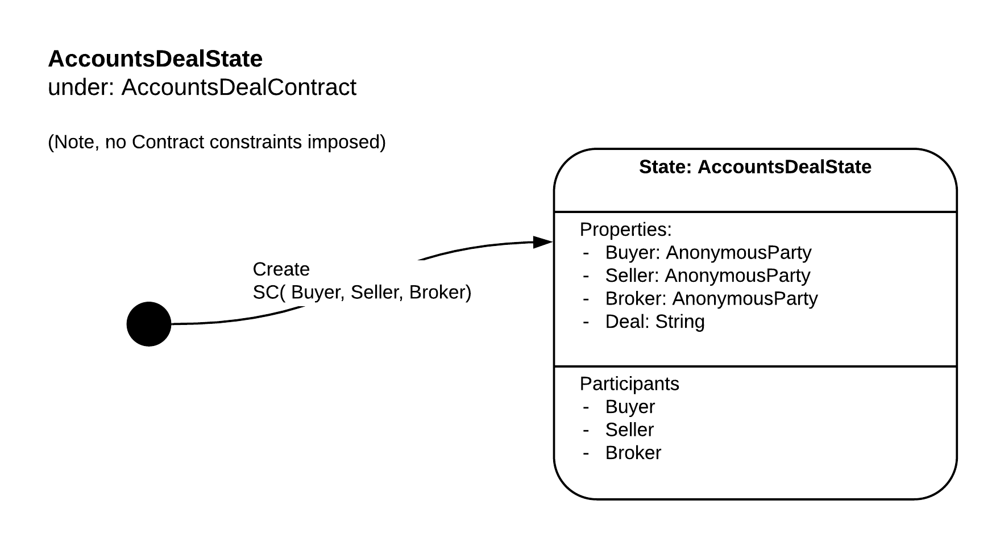

<p align="center">
  
</p>


# Accounts demonstration CorDapp


## Purpose

This is a simple CorDapp which demonstrates the use of the Corda Accounts SDK. It is intended to be used for training both R3 team members and R3 Clients on the basics of using Accounts on Corda. 

The Cordapp has a suite of Flow tests which test the main cordapp functionality. In addition, the CorDapp can be demonstrated using the Corda-Kotlin-Shell, see section below for details


## Use Case

 - A Buyer, Seller and Broker wish to evidence a deal on Corda
 - The deal is described as a simple text String
 - The Buyer, Seller and Broker each hold an account on one of several Corda nodes
 - The Buyer, Seller and Broker accounts may be on the same or different nodes
 - Any of the participants can initiate the transaction.
 - All of the participants host nodes must sign the Transaction


## Design

The Deal is evidenced on the ledger using an AccountsDealState constrained by the AccountsDealContract (Although the contract does not impose any constraints)



The Cordapp has flows for creating the Deals and retrieving the Deals:


 - AccountDealFlow - creates a new deal
 - GetDealsByAccountFlow
 - GetDealsByKeyFlow

These compliment the existing Flows provided by the Accounts SDK: 

 - CreateAccount
 - AllAccounts
 - OurAccounts
 - ShareAccountInfo
 - RequestAccountInfo
 - AccountInfoByKey

The use of these can be seen in the FlowTests and in the Corda-Kotlin-Shell set up scripts and playbook


## Deploying the CorDapp

This cordapp can be deployed by running: 
```
$ ./gradlew deployNodes
```
If you want to deploy a fresh nodes run: 
```text
$ ./gradlew clean
$ ./gradlew deployNodes
```

To start the nodes run the runnnodes script:
```text
$ ./build/nodes/runnodes.sh
```

Note, runnodes does not always start all the nodes properly on mac, if this happens, shut all the terminal windows down and run again

## Corda-Kotlin-Shell

This cordapp can be demonstrated using the Corda-Kotlin-Shell as a flexible RPC client (Currently only available to R3 Internal)

To use the CKS: 

1. clone a fresh version of he CKS from: https://github.com/corda/corda-kotlin-shell
2. checkout tag 'corda-v4.3'
3. Locate the Cordapp jars from one of the nodes in this project, for PartyA they will be in /build/nodes/PartyA/cordapps/ (you will need to have run deployNodes before this)
4. Copy all 5 jars 
 
    - accounts-contracts-1.0.jar
    - accounts-workflows-1.0.jar
    - ci-workflows-1.0.jar
    - contracts-0.1.jar
    - workflows-0.1.jar
 
5. Paste all 5 jars into the Cordapps folder of the CKS project
6. Copy the two script file from Client/CKSScripts folder of this project
 
    - accounts_playbook.kts 
    - setup_accounts_cordapp.kts

7. Paste the scripts into the /scripts/ folder of the CKS project
8. In the CKS project run: 

```text
$ ./one-time-setup.sh
$ ./startup.sh
```

9. in the CKS REPL, load the setup script:

```text
>>> :load scripts/setup_accounts_cordapp.kts
```

You can now follow the steps in the accounts_playbook.kts script which will talk you through a demo of the cordapp.
 
 
## Demonstration

The accounts_playbook.kts script sets out a series of kotlin commands which when executed one by one in the CKS will take the user through a demonstration of the key concepts required for using the Accounts SDK. The playbook also has presenter notes in the comments. 